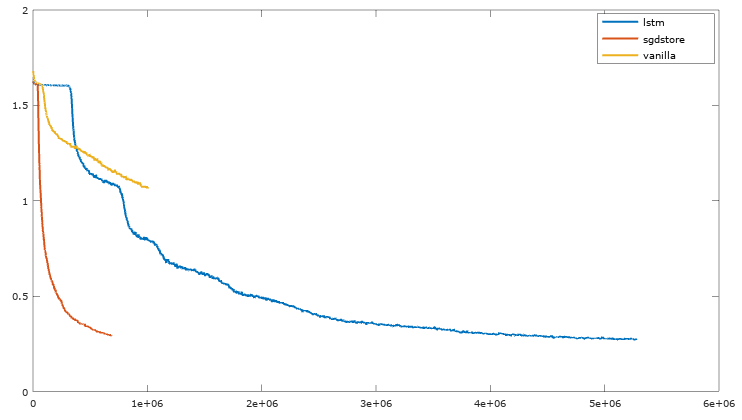
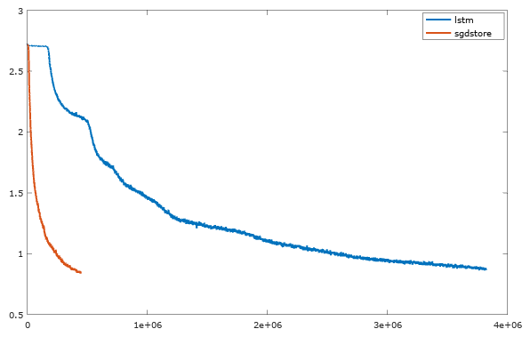

# Omniglot

In an episode of this experiment, the model is presented with a sequence of either 50 or 100 images. It knows beforehand that there are 5 (or 15) different kinds of characters with different labels. However, it does not know what the labels are, nor has it seen the exact characters before. How well can a model learn to do this task, if you train it with enough background knowledge?

# 5-class task

In this task, the sequences are of length 50 and there are 5 different classes. Here are the accuracy numbers for the sgdstore model.

<table>
  <tr>
    <th>Instance 1</th>
    <th>Instance 2</th>
    <th>Instance 3</th>
    <th>Instance 4</th>
    <th>Instance 11</th>
  </tr>
  <tr>
    <td>35.76%</td>
    <td>89.38%</td>
    <td>93.72%</td>
    <td>95.25%</td>
    <td>96.74%</td>
  </tr>
</table>

Note that these results look worse than the results in [Santoro et al.](https://arxiv.org/abs/1605.06065). This is likely due to the fact that I use a different training/evaluation split. In the aforementioned paper, the network is meta-trained on more data and tested on less data. The models I trained did indeed overfit slightly, indicating that more training data would be helpful. I am using the original background/evaluation split from [Lake et al.](http://science.sciencemag.org/content/350/6266/1332).

The following graph shows, for three different models, the validation error over time (measured in episodes) during meta-training. The sgdstore model clearly does the best, but the LSTM catches up after way more training. The vanilla RNN (which is used as a controller for sgdstore), does terribly on its own. I will update the graph after I have run the sgdstore model for longer.

Training in this experiment was done with batch sizes of 64 and a step size of 0.0003. It is likely that hyper-parameter tuning would result in much better results. I discovered in the 15-class task that batches of 16 work much better in terms of data efficiency. I have yet to test larger step sizes, but I bet that will help too.

# 15-class task

In this task, the sequences are of length 100 and there are 15 different classes. Here are the accuracy results for the sgdstore model:

<table>
  <tr>
    <th>Instance 1</th>
    <th>Instance 2</th>
    <th>Instance 3</th>
    <th>Instance 4</th>
    <th>Instance 10</th>
    <th>Instance 11</th>
  </tr>
  <tr>
    <td>9.73%</td>
    <td>77.07%</td>
    <td>84.73%</td>
    <td>87.39%</td>
    <td>87.74%</td>
    <td>90.91%</td>
  </tr>
</table>

Here is a plot of training over time. In this case, I used a batch size of 16 and a learning rate of 0.0003. It is clear that the sgdstore model learns an order of magnitude faster than the LSTM, but once again the LSTM does eventually catch up:

# A note on LSTM results

I have found that I can get much better LSTM results than the ones reported in *Santoro et al.*. They stop training after 100,000 episodes, which seems arbitrary (almost like it was chosen to make their model look good, since it learns faster). I don't want to confuse learning speed with model capacity, which *Santoro et al.* seems to do.

I use two-layer LSTMs with 384 cells per layer. This is likely much more capacity than Santoro et al. allow for their LSTMs. I think it would be unfair not to give LSTMs the benefit of the doubt, even if their learning speeds are a lot worse than memory-augmented neural networks.
