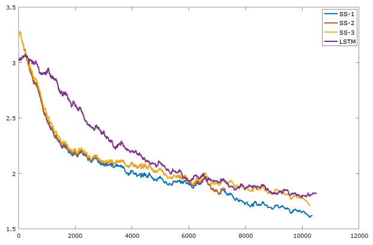

# Polynomial Approximation

In this experiment, an RNN is trained on a simple meta-learning task. During each episode of this task, the RNN has to learn to approximate a new, random polynomial.

Before each episode, the trainer generates a random third-degree polynomial of three variables (e.g. `xyz + 0.5xy^2 + 1 + ...`). At each timestep of the episode, the RNN receives a tuple `(out_{t-1}, x, y, z)` and must predict the polynomial's value at `(x, y, z)`. At timestep `t`, `out_{t-1}` is the value which should have been predicted at timestep `t-1`. This way, the RNN can immediately see its mistakes and learn from them. Each episode is 64 timesteps in total. The RNN's goal is to minimize the mean-squared error of its predictions over the entire episode.

# Results

For these experiments, I tried an LSTM and three variants of the same sgdstore model. The LSTM had 51521 parameters, whereas the sgdstore models only had 6578 parameters. Nonetheless, the LSTM was much faster in terms of wall-clock time.

I tried three different settings for the sgdstore models. The SS-1, SS-2, and SS-3 models run SGD at each timestep for 1, 2, and 3 iterations respectively. I was expecting SS-3 to win out, since the model gets to train its MLP for longer at each timestep. However, SS-3 did not learn as fast as SS-1 in the short-run. I stopped SS-2 early because I thought the results of SS-1 and SS-3 would be more meaningful.

Here's a graph of the MSE (y-axis) versus the iteration (x-axis; batches of 16):

The graphs make it look like the sgdstore model learns faster than the LSTM. However, keep in mind that the LSTM is several times faster in terms of wall-clock time.
